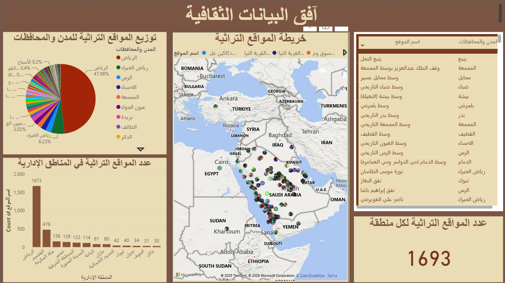

# Cultural Data Horizon

Interactive Power BI dashboard developed for the Cultural Data Gathering Challenge in celebration of Saudi National Day 94.

Overview

Cultural Data Horizon uses Power BI to visualize and analyze cultural heritage sites across Saudi Arabia.

The dashboard presents the distribution of heritage sites across cities and regions through interactive visualizations, including a geographic map, charts, and detailed site information.

The project aims to highlight Saudi Arabia's rich cultural heritage and make cultural data easier to explore and understand.

Key Features

- Interactive map of cultural heritage sites across Saudi Arabia
- Distribution of heritage sites by cities and regions
- Charts for comparing the number of heritage sites
- Detailed information about individual heritage locations
- Interactive Power BI dashboard

Tools

- Power BI
- Data Visualization
- Data Analysis

Hackathon

Cultural Data Gathering Challenge

September 2024

Saudi National Day 94
